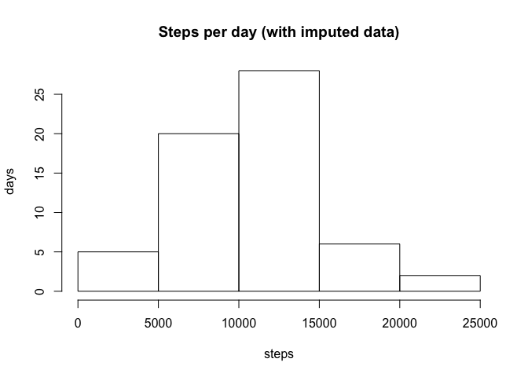

# Reproducible Research: Peer Assessment 1
 

## Loading and preprocessing the data
Load activity.csv and replace NA with 0, check for content


```r
a <- read.csv("activity.csv" ) 
a[is.na(a)] <- 0
```

## What is mean total number of steps taken per day?
Aggregate data by date, compute total number of steps for each day, take a mean of that list.

```r
agg <- aggregate(a$steps,by=list(date=a$date),sum)
head(agg)
```

```
##         date     x
## 1 2012-10-01     0
## 2 2012-10-02   126
## 3 2012-10-03 11352
## 4 2012-10-04 12116
## 5 2012-10-05 13294
## 6 2012-10-06 15420
```

```r
means <- round(mean(agg[,2]))
medians <- as.integer(median(agg[,2]))
```

Plot the histogram of number of steps per day

```r
hist(agg[,2],xlab='steps',ylab='days', main='Steps per day')
```

 

Mean total number of steps per day = 9354  
Median total number of steps per day = 10395

## What is the average daily activity pattern?

```r
agint <- aggregate(a$steps,by=list(interval=a$interval),mean)
head(agint)
```

```
##   interval          x
## 1        0 1.49180328
## 2        5 0.29508197
## 3       10 0.11475410
## 4       15 0.13114754
## 5       20 0.06557377
## 6       25 1.81967213
```

```r
tail(agint)
```

```
##     interval         x
## 283     2330 2.2622951
## 284     2335 4.0819672
## 285     2340 2.8688525
## 286     2345 0.5573770
## 287     2350 0.1967213
## 288     2355 0.9344262
```

```r
plot(agint$interval,agint$x,type="l",xlab="time",ylab="steps")
```

 

```r
moststep <- agint$interval[which.max(agint$x)]
```

Most active interval is 835.

## Imputing missing values, using previously computed mean for that interval

```r
b <- read.csv("activity.csv" ) 
m <- is.na(b$steps)
mc <- nrow(b)
tm <- sum(m)
for(i in (1:mc)) 
  {
    if(is.na(b$steps[i])) {
      b$steps[i] <- agint$x[match(b$interval[i],agint$interval)]
      }
  }
```
Total missing values: 2304 out of 17568.


```r
## histogram and mean/median for new dataset
aggb <- aggregate(b$steps,by=list(date=b$date),sum)
head(aggb)
```

```
##         date        x
## 1 2012-10-01  9354.23
## 2 2012-10-02   126.00
## 3 2012-10-03 11352.00
## 4 2012-10-04 12116.00
## 5 2012-10-05 13294.00
## 6 2012-10-06 15420.00
```

```r
meansb <- as.integer(round(mean(aggb[,2])))
mediansb <- as.integer(round(median(aggb[,2])))

hist(aggb[,2],xlab='steps',ylab='days', main='Steps per day (with imputed data)')
```

 

After imputing the data:  
Mean total number of steps per day = 10581.
Median total number of steps per day = 10395.

We see that median remained the same (half of imputed values should be below median, half above - makes sense) while mean has grown (also makes sense as we use computed mean numbers instead of 0s).

## Are there differences in activity patterns between weekdays and weekends?
Adding new factor

```r
a$DayOfWeekType <- ifelse(weekdays(as.Date(a$date)) %in% c('Saturday','Sunday'), 'Weekend', 'Weekday')
agdayint <- aggregate(a$steps,by=list(interval=a$interval,day=a$DayOfWeekType),mean)
head(agdayint)
```

```
##   interval     day          x
## 1        0 Weekday 2.02222222
## 2        5 Weekday 0.40000000
## 3       10 Weekday 0.15555556
## 4       15 Weekday 0.17777778
## 5       20 Weekday 0.08888889
## 6       25 Weekday 1.31111111
```

```r
library(ggplot2)
```

```
## Warning: package 'ggplot2' was built under R version 3.1.3
```

```r
qplot(interval,x,data=agdayint,facets=day~.,geom='line',ylab='number of steps')
```

 
